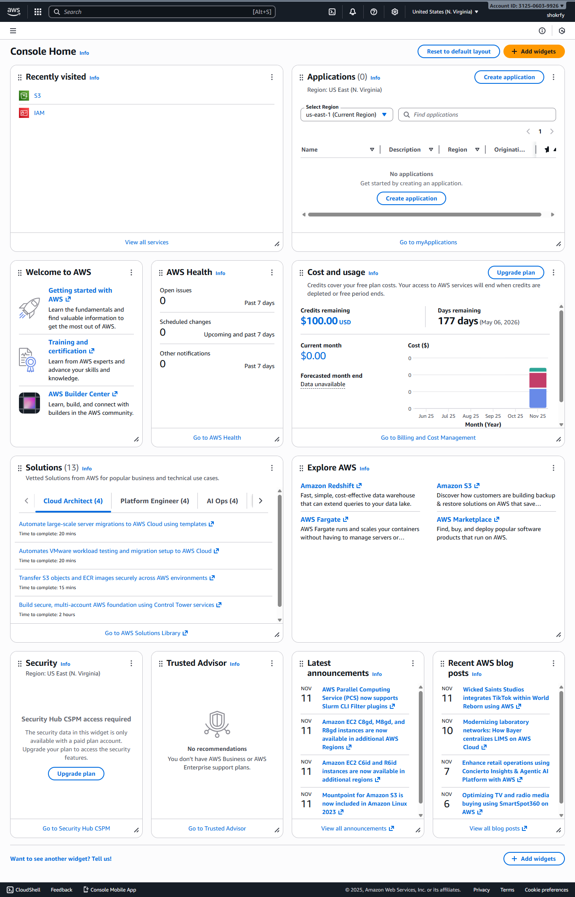
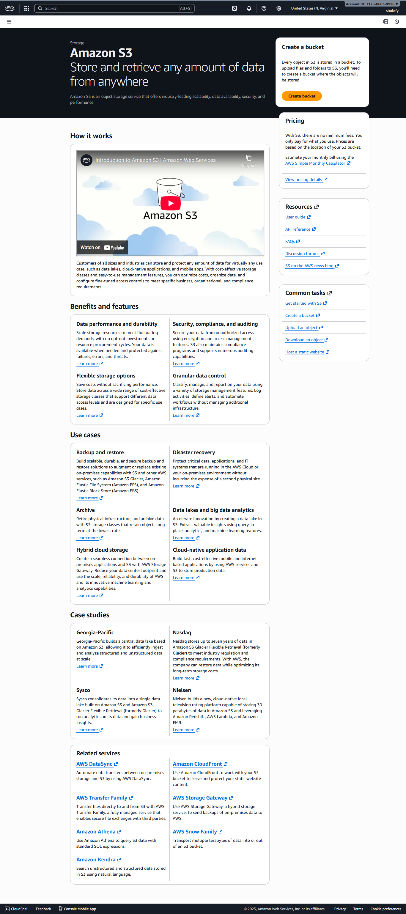
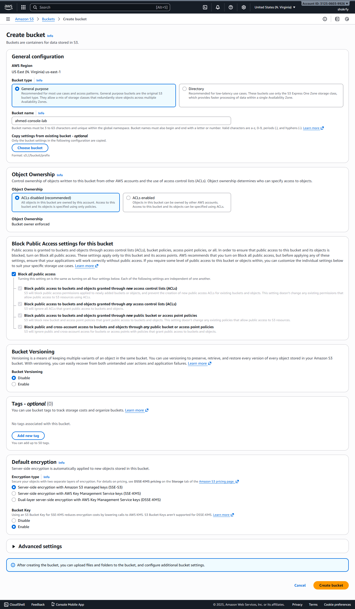
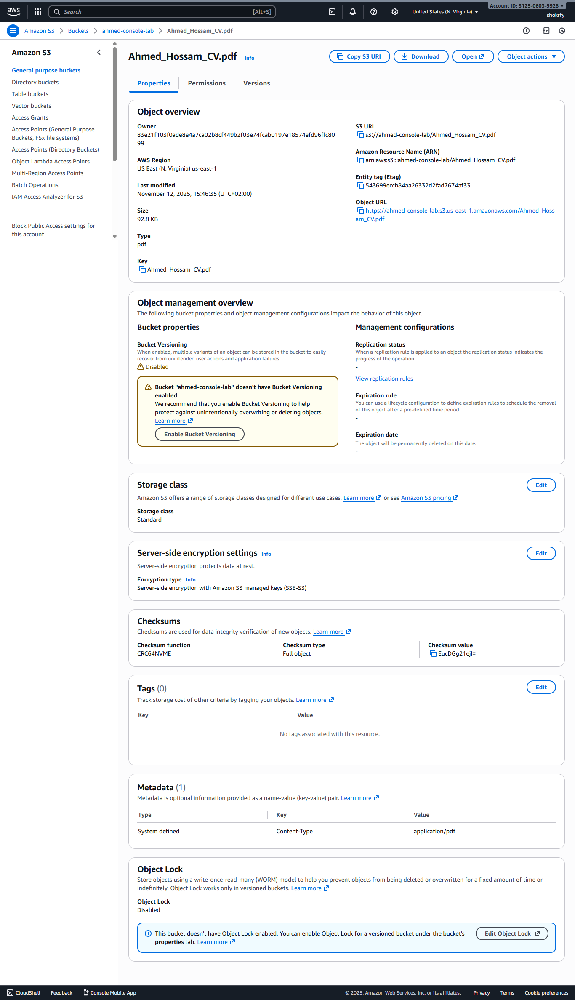

# 🖥️ AWS Management Console Lab

## 🎯 Objective
Document the process of accessing the AWS Management Console, creating an S3 bucket, and uploading a file — all with visual evidence (screenshots).

---

## Step 1 – Login to AWS Console

### Description
1. Opened [https://aws.amazon.com/console](https://aws.amazon.com/console)  
2. Clicked **Sign In to the Console**  
3. Selected **Root user** (for personal account) or **IAM user** (for Academy/Training accounts)  
4. Entered email and password  
5. Successfully signed in to the AWS Management Console.

### Screenshot

---

## Step 2 – Accessing Amazon S3

### Description
After logging in, used the search bar in the AWS Console to locate and open **Amazon S3**.

### Screenshots

---

## Step 3 – Creating an S3 Bucket

### Description
1. Clicked **Create bucket**  
2. Entered the following:
   - **Bucket name:** `ahmed-console-lab`
   - **Region:** `eu-central-1`
3. Left default settings (Block public access enabled)
4. Clicked **Create bucket**

### Screenshots

---

## Step 4 – Uploading a File to S3

### Description
1. Opened the bucket `ahmed-console-lab`
2. Clicked **Upload → Add files**
3. Selected `test.txt` from local system
4. Clicked **Upload**

### Screenshots

---

## Step 5 – Viewing Object Details

### Description
Viewed the uploaded object metadata and noted the public URL for reference.

- **Object URL:**  
  `https://s3.eu-central-1.amazonaws.com/ahmed-console-lab/test.txt`

### Screenshot

---

## ✅ Summary
| Action | Status |
|--------|---------|
| Logged into AWS Console | ✅ Successful |
| Accessed Amazon S3 | ✅ Successful |
| Created S3 bucket | ✅ Successful |
| Uploaded file to S3 | ✅ Successful |
| Verified object details | ✅ Successful |

---

## 📚 References
- [AWS S3 Getting Started Guide](https://docs.aws.amazon.com/AmazonS3/latest/userguide/GetStartedWithS3.html)
- [AWS Console Overview](https://docs.aws.amazon.com/awsconsolehelpdocs/latest/gsg/getting-started.html)
